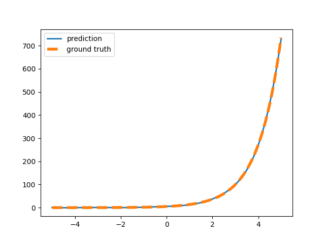
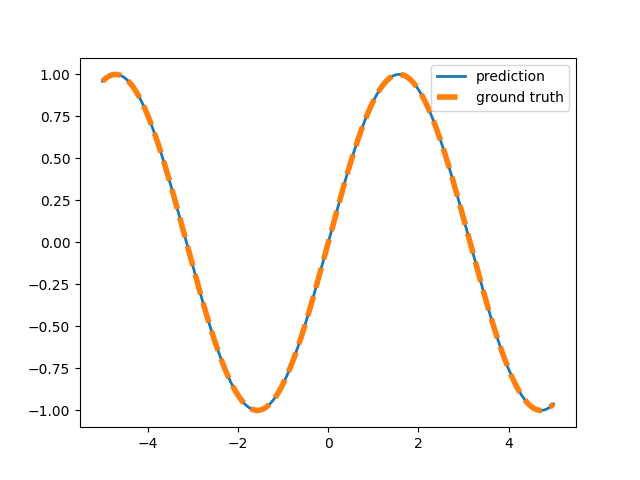

# Incremental sparse spectrum gaussian process regression

## Mathematics

The posterior can be represented by 

$`p(y|x_\ast, X, y)`$ ~ $`\mathcal{N}(\phi(x_\ast)A^{-1}\Phi^{T}y, \sigma_n^{2}(1+\phi(x_\ast)^TA^{-1}\phi(x_\ast))`$

where $` A = \Phi^{T}\Phi + \sigma_n^{2} \Sigma_p^{-1}`$.

Let's feature dimension be D.

First of all, create D by n random frequencies.

$` \mathbf{\omega}`$ ~ $`\mathcal{N}( \mathbf{0}, \mathbf{M} ) `$

where $`\mathbf{M} = diag([l_1^{-2},l_2^{-2},...l_n^{-2}])`$.

## The feature mapping

- $` \phi = \frac{\sigma_f}{\sqrt{D}}[cos(\mathbf{\omega}^T x_{new})^T sin(\mathbf{\omega}^T x_{new})^T]^T `$

From the mean value of the posterior, the weight is defined like the following

- $` \mathbf{w} = A^{-1}\Phi^{T}\mathbf{y} `$.

The vector $`\mathbf{b}`$ is defined as $`\mathbf{b} = \Phi^T\mathbf{y}`$.

## The weight update method

Rank 1 update.

- $` A_{t} = A_{t-1} + \phi \phi^{T} `$
- $` A_{t} = R_{t}^T R_{t} `$
- $` R_{t} = cholesky(A_{t})^{T}`$
- $` b_{t} = b_{t-1} + \phi y_{t}^T `$
- $` w_{t} = A_{t}^{-1} b_{t} `$

## The predict method

- $` y_{\ast} = \phi^T w `$
- $` \phi^T A^{-1} \phi = \phi^T(R^{T}R)^{-1}\phi `$
- $` \phi = R^{T}v `$
- $` var = \sigma_{n}^2(1+v^{T}v) `$

## Result 1 (Exponential function)

## Result 2 (Sinusoidal function)

